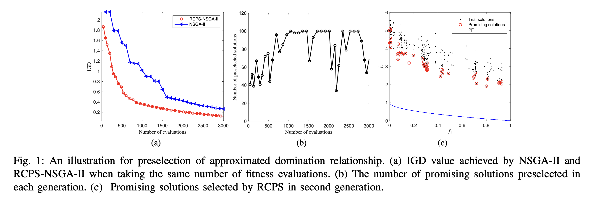
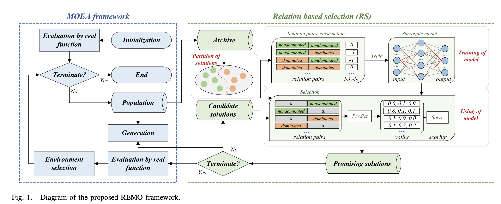
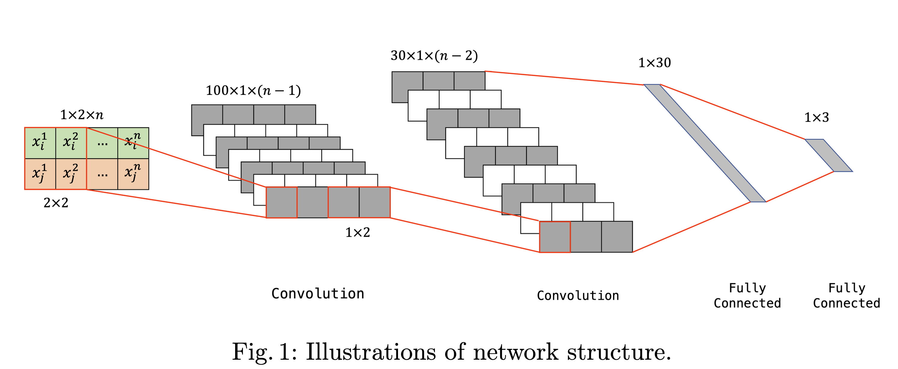

# RelationModel-matlab
A matlab version of relation model.

The code is collected in the RelationModel folder, supporting use on the latest [PlatEMO-4.5](https://github.com/BIMK/PlatEMO) platform. Please place the RelationModel folder in the root directory of PlatEMO for easy access. You can also manually add the RelationModel folder to Matlab's search path.

* **Three** evolutionary algorithms based on the relation model have been implemented so far.
* In the RelationModel folder, the related functions are only initially implemented. The plan is to use the same code structure and function names as the [Python version](https://github.com/hhyqhh/Relation) in future updates, to facilitate maintenance and updating. ❗️
* The implementation of other related algorithms is still in progress, so stay tuned. 🚗

---
### RCPS-MOEA

We extend RCPS to the multi-objective problem (MOP), accelerating the convergence speed of multi-objective evolutionary algorithms by predicting approximations domination between two solutions through relation models. ([code](https://github.com/hhyqhh/Relation-matlab/blob/main/PlatEMO-4.5/Algorithms/Multi-objective%20optimization/RCPS-MOEA/), [paper](https://ieeexplore.ieee.org/abstract/document/9504781)) 

> Hao H, Zhou A, Zhang H. An approximated domination relationship based on binary classifiers for evolutionary multiobjective optimization[C]//2021 IEEE Congress on Evolutionary Computation (CEC). IEEE, 2021: 2427-2434.

### REMO
>Hao H, Zhou A, Qian H, et al. Expensive multiobjective optimization by relation learning and prediction[J]. IEEE Transactions on Evolutionary Computation, 2022, 26(5): 1157-1170.

In this work, by designing a relation model to assist the evolutionary algorithm in solving expensive multi-objective optimization problems, the paper proposes an adaptive classification strategy and a voting scoring strategy to enhance the performance of relation models. ([code](https://github.com/hhyqhh/Relation-matlab/blob/main/PlatEMO-4.5/Algorithms/Multi-objective%20optimization/REMOHH/), [paper](https://ieeexplore.ieee.org/abstract/document/9716917))

### CREMO
>Hao H, Zhou A. A Relation Surrogate Model for Expensive Multiobjective Continuous and Combinatorial Optimization[C]//International Conference on Evolutionary Multi-Criterion Optimization. Cham: Springer Nature Switzerland, 2023: 205-217.

We apply convolutional neural networks~(CNN) to the learning of relation data, effectively overcoming challenges related to data types and dimensions, and demonstrating good performance on continuous, discrete problems as well as mid-to-high dimensional issues. ([code](https://github.com/hhyqhh/Relation-matlab/blob/main/PlatEMO-4.5/Algorithms/Multi-objective%20optimization/CREMO/), [paper](https://link.springer.com/chapter/10.1007/978-3-031-27250-9_15)) 

